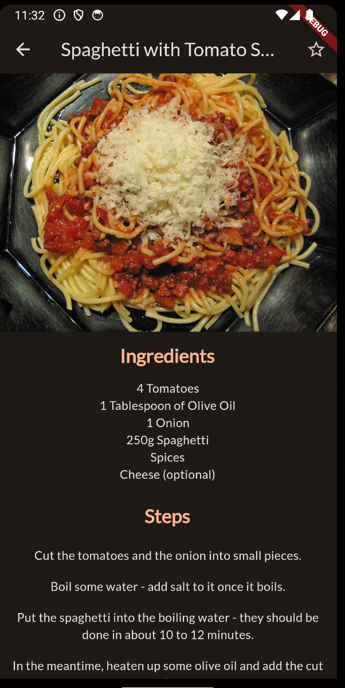
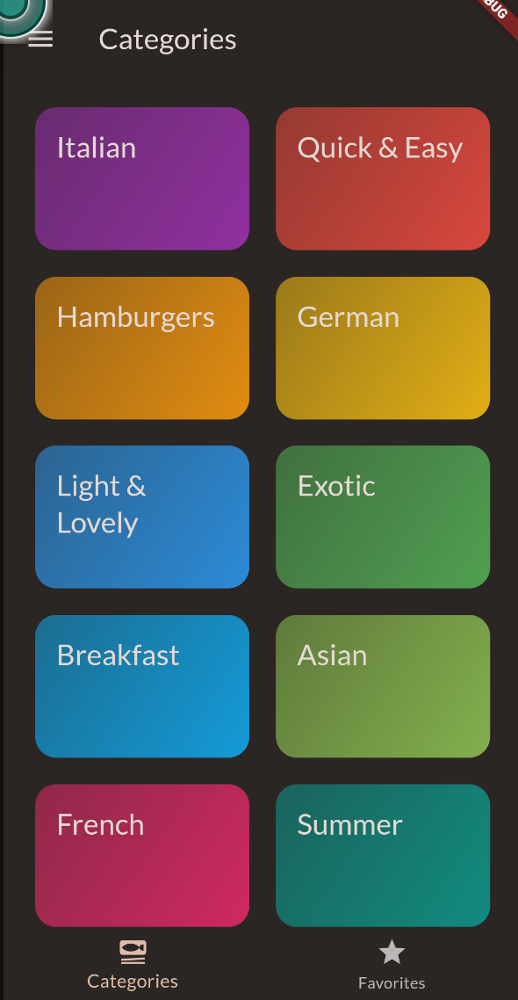

# Meals App

Meals is a simple Flutter application that helps you discover tasty meal recepies. It allows you to filter reciepes based on your preferences and favorite your meals.

## Features

- Browse through various categories of meals.
- Click on a meal and see ingredients and steps to prepare it.
- Favorite meals and view them in a separate screen.
- Filter meals based on your preferences.

## Screenshots

## Getting Started

To get started with this project, follow these steps:

1. Clone the repository to your local machine:

`git clone https://github.com/Sebastiannilsen/meals.git`

2. Open the project in your preferred Flutter development environment (e.g., Android Studio, VS Code).

3. Install the required dependencies by running:

`flutter pub get`

4. Run the app on an emulator or physical device:

`flutter run`

5. Start managing your expenses!

## App Architecture

The Meals app follows a clean Flutter architecture, separating UI, data, and business logic. The core components of the app's architecture include:

- **Data**: The dummy data used in the application.

- **Models**: Defines the data structures used in the app, including the `meal` class for individual meals and the `category` class for grouping meals by category.

- **Widgets**: Custom UI widgets used throughout the app, including the `meal_item` widget for displaying individual meals and the `category_item` widget for displaying meal categories.

- **Providers**: Manages app state and data, allowing widgets to access and modify data.

- **Screens**: The main screens of the app, including the `categories_screen` for displaying meal categories, the `category_meals_screen` for displaying meals in a category, and the `meal_detail_screen` for displaying details about a meal.

## User Stories and Specifications

- **User Story 1: Find a good meal
  - As a user, I want to find a good meal to cook.
    - Specifications:
        - The user can browse through a list of meal categories.
        - The user can browse through a list of meals in a category.
        - The user can view details about a meal, including ingredients and steps to prepare it.
        - The user can favorite a meal and view it in a separate screen.

- **User Story 2: Filter meals
- As a user, I want to filter meals based on my preferences.
    - Specifications:
        - The user can filter meals based on gluten-free, lactose-free, vegan, and vegetarian preferences.

## File and Folder Structure

- **lib/**
  - **main.dart**: The entry point of the app.
  - **models/**
    - **category.dart**: Defines the `category` class for grouping meals by category.
    - **meal.dart**: Defines the `meal` class for individual meals.
  - **providers/**
    - **favorites_provider.dart**: Manages the list of favorite meals.
    - **meals_provider.dart**: Manages the list of meals and provides methods for filtering meals.
    - **filters_provider.dart**: Manages the user's meal preferences.
  - **screens/**
    - **categories.dart**: Displays a list of meal categories.
    - **filters.dart**: Displays a list of meal preferences.
    - **meal_details.dart**: Displays details about a meal.
    - **meals.dart**: Displays a list of meals in a category.
    - **tabs.dart**: Displays tabs for navigating between the categories and favorites screens.
  - **widgets/** 
    - **category_grid_item.dart**: Displays a meal category.
    - **main_drawer.dart**: Displays a drawer for navigating between the categories and favorites screens.
    - **meal_item.dart**: Displays a meal.
    - **meal_item_trait.dart**: Displays a trait of a meal, such as gluten-free or vegan.

## Dependencies

This project uses the following packages and dependencies:

- Flutter: [https://flutter.dev/](https://flutter.dev/)
- google_fonts [https://pub.dev/packages/google_fonts](https://pub.dev/packages/google_fonts)
- flutter_riverpod [https://pub.dev/packages/flutter_riverpod](https://pub.dev/packages/flutter_riverpod)
- transparent_image [https://pub.dev/packages/transparent_image](https://pub.dev/packages/transparent_image)
